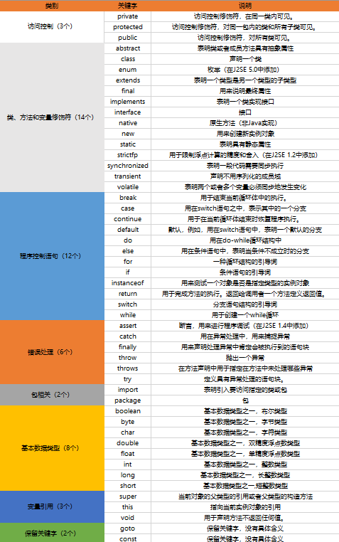

# JAVA基础知识
## JAVA简介
### 什么是java
Java 是一门面向对象编程语言
- - -
### 语言特点与应用场景
Java语言具有简单性,面向对象,分布式,健壮性,安全性,跨平台性,可以执行,多线程与动态性等特点.Java语言可以编写桌面应用程序,Web应用程序,分布式系统和嵌入式系统等.java快速,安全,可靠.从笔记本电脑到数据中心,从游戏控制台到超级计算机,从手机到互联网,java无处不在!
- - -
### JVM, JRE和JDK的关系
JVM
Java Virtual Machine是Java虚拟机,Java程序需要运行在虚拟机上,不同的平台有自己的虚拟机,因此Java语言可以实现跨平台

JRE
Java Runtime Environment包括java虚拟机和Java程序所需的核心类库等.核心库主要是 java.long 包:包含了运行Java程序必不可少的系统类,如基本数据类型,基本数学函数,字符串处理,线程,异常处理等类,系统缺省加载这个包
如果想要运行一个开发好的Java程序,计算机中只需要安装JRE即可

JDK
Java Development Kit 是提供给Java开发人员使用的,其中包含了Java的开发工具,也包括了JRE.所以安装了JDK,就无需再单独安装JRE了.其中的开发工具:编译工具(java.exe),打包工具(jar.exe)等
- - -
## Java语言特点
### Java语言是简单的
1. Java语言的语法和C语言和C++语言很接近,从某种意义上讲,它是由C和C++演变而来,使得大多数程序员很容易学习和使用
2. 对于C++来说进行了简化和一定的提高,如:使用接口代替了复杂的多重继承以及取消了指针,还通过实现垃圾自动回收机制,大大简化了程序员的资源释放管理工作
3. 提供了丰富的类库和API接口,以及第三方开发包工具包,还有大量的基于Java的开源项目, 帮助程序设计人员参考学习,JDK就是开放的源代码之一,读者可以通过分析项目的源代码,来提高自己的编程水平
### Java语言是面向对象的
面向对象就是Java语言的基础,也是Java语言的重要特征.面向对象是指以对象为基本单元,包含属性和方法.对象的状态用属性表达,对象的行为用方法表达.
面向对象技术是的应用程序的开发变得简单易用,节省代码.总之,Java语言是一个纯面向对象的程序设计语言
### Java语言是分布式的
1. 分布性主要包括两大方面,分别是操作分布和数据分布,其中操作分布指的是再多个不同的主机上布置相关操作,数据分布是将数据分别在多个网络中不同的主机上,借助的是URL(统一资源定位符)访问网络对象,访问方式和访问本地系统相似.
2. Java语言具有一个强大的,易于使用的网络能力,这是非常适合分布式计算程序的.
3. Java语言支持Internet应用的开发,在基本的Java应用编程接口有一个网络应用程序接口(java.net),它提供了用于网络应用的编程的类库,包括URL,URLConnection,Socket,Server Socket等.Java的RMI(远程方法激活)机制也是开发分布式应用的重要手段.
### Java语言是多线程的
多线程机制使应用程序在同一时间并行执行多项任务,Java语言提供多线程之间的同步机制,这些相应的同步机制可以很好的保证不同线程,能正确的共享数据.多线程机制使程序具有更好的交互性和实时性.
### Java语言是高性能的
1. Java是一种先编译后解释的语言,所以它不如全编译性语言快.但是有些情况下性能很要紧的,为了支持这些情况,Java设计师制作了"及时"编译程序,它能在运行时把Java字节码翻译成特定CPU(中央处理器的)机器代码,也就是实现全编译了.Java字节码格式设计时考虑到这些"及时"编译程序的需要,所以生成机器代码的过程相当简单,它能产生相当好的代码.
2. 与那些解释型的高级脚本语言相比,Java的确是高性能的.事实上Java的运行速度随着JIT(just-in-Time)编辑器技术的发展与来越接近于C++
### Java语言是跨平台的
1. 所谓的跨平台性,是指软件可以不受计算机硬件和操作系统的约束而在任意计算机环境下正常运行.这是软件发展的趋势和编程人员追求的目标.之所以这样说,是因为计算机硬件的种类繁多,操作系统也各不相同,不同的用户和自己的公司有自己不同的计算机环境偏好,而软件为了能在这些不同的环境里运行,就需要独立于这些平台.
2. 在Java语言中,Java自带的虚拟机很好地实现了跨平台性.Java源代码经过编译后生成二进制的字节码是与平台无关的,Java虚拟机在执行字节码时,把字节码解释成具体平台上的机器指令执行.这就是Java的能够Write once, run anywhere(一次编译，到处运行)的原因。Java虚拟机提供了一个字节码到底层硬件平台及操作系统的屏障，使得Java语言具备跨平台性。
### Java语言是可以移植的
可移植性来源于跨平台性,另外,Java还严格规定了各个基本数据类型的长度.Java系统本身也具有很强的可移植性,Java编译器使用Java实现的,Java的运行环境使用 ANSI C 实现的
### Java语言是安全的
在Java语言中删除了类似于C语言中的指针和内容释放等语法,有效的避免了非法操作内存,代码要经过校验之后才能够运行,所以未经允许的Java程序不可能出现损害系统平台的行为,最大的好处就是,Java可以编写防病毒和可修复的系统,Java通常被用在网络环境中,为此,Java提供了一个安全机制以防恶意代码的攻击,从而可以提高系统的安全性
### java语言是健壮的
Java语言的强类型机制,异常处理,垃圾的自动手机等是Java程序健壮性的重要保证.对指针的丢弃是Java的明智选择.Java的安全检查机制是的Java更具健壮性.
### Java语言是动态的
1. Java语言的设计目标之一是适应于动态变化的环境.Java程序需要的类能够动态地被载入到运行环境,也可以通过网络来载入所需要的类,这也有利于软件的升级
2. Java中的类有一个运行时刻的表示,能进行运行时刻的类型检查
- - - 
## 补充知识(编译型语言和解释型语言)
### 1.编译型语言和解释型语言
#### 编译型语言
定义:在程序运行之前通过编译器将源程序编译成机器码(可运行的二进制代码),以后执行这个程序时,就不需要在进行编译了
优点:编译器一般会有预编译的过程和对代码进行优化.因为编译只做一次,运行时不需要编译,所以以编译型语言的程序执行效率高,可以脱离语言环境独立运行
缺点:编译之后如果需要修改就需要整个模块重新编译.编译的时候根据对应的运行环境生成机器码,不同的操作系统之间的移植就会有问题,需要根据运行的操作系统环境编译不同的可执行文件
总结:执行速度快,效率高;依靠编译器,跨平台性差一些
代表语言:C,C++,Pascal,Object-C以及Swift
#### 解释型语言
定义:解释型语言的源代码不是直接翻译成机器码的,而是先翻译成中间代码,再由解释器对中间代码进行解释运行.在运行的时候才将源程序翻译成机器码,翻译一句,然后执行依据,直至结束
优点:有良好的平台兼容性,在任何环境中都可以运行,前提是安装了解释器(虚拟机).灵活,修改代码的时候直接修改就可以,可以快速部署,不用停机维护
缺点:每次运行的时候都要解释一遍,性能上不如编译型语言.
总结:执行速度慢,效率低;依靠解释器,跨平台性好
代表语言:JavaScrip,Python,Erlang,PHP,Perl,Ruby
#### 混合型语言
定义:既然编译型和解释型各有缺点就会有人想到吧两种类型整合起来,取其精华去其糟泊,就出现了半编译,半解释型语言.
比如C#,C#在编译的时候不是直接编译成机器码而是中间码, .NET平台提供了中间语言运行库运行中间码,中间语言运行库类似于Java虚拟机. .NET在编译成IL代码后,保存在dll中,首次运行时由JIT在编译成机器码缓存在内存中,下次直接执行.严格来说混合型语言属于解释型语言,C#更接近编译型语言
##### Java即是编译型的,也是解释型语言,总的来说Java更接近解释型语言
* 可以说它是编译型的.因为所有的Java代码都是要编译的, .java 不经过编译就什么用都没有.同时围绕JVM的效率问题,会涉及一些JIT,AOT等优化技术,例如JIT技术,会将热点代码编译成机器码.而AOT技术,是在运行前,通过工具直接将字节码转化为机器码.
* 可以说它是解释型的.因为Java代码编译后不能直接运行,它是解释运行在JVM上的,所以他是解释运行的.
### 2.动态类型语言和静态类型语言
#### 动态类型语言
动态类型语言:在运行期间才去做数据类型的检查的语言,说的是数据类型.动态类型语言的数据类型不是在编译阶段决定的,而是把类型绑定延后到了运行阶段.
代表语言: python , ruby , erlang , JavaScript , swift , PHP , perl
#### 静态类型语言
静态类型语言的数据类型是在编译期间(或运行之前)确定的,编写代码的时候要明确确定变量的数据类型.
代表语言:C , C++ , C# , Java ,Object-C
### 3.动态语言和静态语言
#### 动态语言
动态类型语言和东岱语言是完全不同的两个概念
动态语言:说的是运行时改变结构,说的是代码结构.在运行时可以改变其结构的语言:例如新的函数,对象,甚至代码可以被引进,已有的函数可以被删除或是其他结构上的变化.通俗点说就是在运行时代码可以根据某些条件改变自身结构
代表语言:Object-C , C# , JavaScript , PHP , python , erlang
#### 静态语言
与动态语言相对应的,运行时结构不可变的语言就是静态语言
代表语言:Java , C , C++ 
- - -
## 基础语法
### Java标识符
#### 定义
* 给包,类,方法,变量起名字的符号
#### 组成规则
* 标识符由字母,数字,下划线,美元符号($)组成
#### 命名原则
* 包名:全部小写,多级包用 . 隔开
举例:com.scit
* 类,接口:一个单词首字母大写,多个单词每个单词的首字母大写(驼峰)
举例: Student , Car , HelloWorld
* 方法和变量:一个单词首字母小写,多个单词从第二个单词开始每个单词的首字母大写.
举例:age , maxAge , show() , getAge()
* 常量:如果是一个单词,所有字母大写,如果是多个单词,所有的单词大写,用下划线区分每个单词.
举例:DATE，MAX_AGE
* 项目名：全部用小写字母，多个单词之间用 - 分割
举例: demo , spring-boot
#### 注意事项
* 不能以数字开头
* 不能是Java中的关键字
* Java标识符大小写敏感,长度无限制
* 标识符不能包含空格
- - - 
### Java关键字

注意事项:
* true , false 和 null 看起来像关键字,但他们实际上是文字;您不能在程序中将它们作标识符
### Java注释
定义:
* 用于解释说明程序的文字

分类:
* 单行注释 格式:  //注释文字
* 多行注释 格式:  /\*注释文字\*/
* 文档注释 格式:  /\*\*注释文字\*\*/
作用:
* 在程序中,尤其是复杂的程序中,适当的加入注释可以增加程序的可读性,有利于程序的修改,调试和交流.注释的内容在程序编译的时候会被忽视,不会产生目标代码,注释的部分不会对程序的执行结果产生任何影响
注意事项:
* 多行和文档注释都不能嵌套使用
- - -
### Java访问修饰符
定义:
* Java中,可以使用访问修饰符来保护对类,变量,方法和构造方法的访问.Java支持4中不同的访问权限

分类:
* private:在同一类内可见.使用对象:变量方法.注意:不能修饰类(外部类)
* default(即缺省,什么也不写,不使用任何关键字):在同一包内可见,不适用任何修饰符.使用对象:类,接口,变量,方法
* protected:对同一包内的类和所有子类可见.使用对象,:变量,方法.注意:不能修饰类(外部类)
* public:对所有类可见.使用对象:类,接口,变量,方法

访问修饰符图:
|  修饰符   | 当前类 | 同包  | 子类  | 其他包 |
| :-------: | :----: | :---: | :---: | :----: |
|  private  |   ✔    |   ❌   |   ❌   |   ❌    |
|  default  |   ✔    |   ✔   |   ❌   |   ❌    |
| protected |   ✔    |   ✔   |   ✔   |   ❌    |
|  public   |   ✔    |   ✔   |   ✔   |   ✔    |
- - - 
### Java分隔符
定义:
* 空格,逗号,分号以及行结束符都被称为分隔符,规定任意两个相邻标识符,数字,保留字或语句之间必须至少有一个分隔符,以便程序编译时能够识别

分类:
* ; 用来终止一个语句
* {} 用来包括自动初始化的数组的值,与用来定义程序块,类,方法以及局部范围
* [] 用来声明数组的类型,也用来表示撤销对数组值的引用
* , 在变量声明中,区分变量说明的各个变量.在for语句中,用来将圆括号内的语句连接起来.
* . 用来将软件包的名字与它的子包或类分隔.也用来将引用变量与变量或方法分隔
* () 在定义和调用方法时用来容纳参数表.在控制语句或强制类型转换组成的表达式中用来表示执行或计算的优先权
- - - 
### Java流程控制语句
#### 顺序结构
定义:顺序结构是程序中最简单最基本的流程控制,没有特定的语法结构,按照代码的先后顺序,依次执行,程序中大多数代码都是这样执行的
举例:
```java
/*
* 顺序结构:从上往下,依次执行 
*/
public class OrderDemo{
    public static void main(String[] args){
        System.out.println("开始");
        System.out.println("语句A");
        System.out.println("语句B");
        System.out.println("语句C");
        System.out.println("结束");
    }
}
```
#### 分支结构
定义:条件语句可根据不同的条件执行不同的语句.包括if条件语句与switch多分支语句

- - -
##### if语句
第一种if语句
```java
public class IfDemo{
    public static void main(String[] args){
        System.out.println("开始");
		// 定义两个变量
		int a = 10;
		int b = 20;

		if (a == b) {
			System.out.println("a等于b");
		}
	
		int c = 10;
		if (a == c) {
			System.out.println("a等于c");
		}
	
		System.out.println("结束");
    }
}
```
- - -
第二种if
```java
public class IfDemo2 {
	public static void main(String[] args) {
		System.out.println("开始");
		// 判断给定的数据是奇数还是偶数
		// 定义变量
	int a = 100;
		// 给a重新赋值
	a = 99;

	if (a % 2 == 0) {
		System.out.println("a是偶数");
	} else {
		System.out.println("a是奇数");
	}

		System.out.println("结束");
	}
}
```
- - -
第三种if
```java
public class IfDemo3 {
	public static void main(String[] args) {
		// x和y的关系满足如下：
		// x>=3 y = 2x + 1;
		// -1<=x<3 y = 2x;
		// x<=-1 y = 2x – 1;
		// 根据给定的x的值，计算出y的值并输出。

		// 定义变量
		int x = 5;
		int y = 0;
		if (x >= 3) {
			y = 2 * x + 1;
		} else if (x >= -1 && x < 3) {
			y = 2 * x;
		} else if (x <= -1) {
			y = 2 * x - 1;
		}
		
		System.out.println("y的值是："+y);
	}
}
```
注意事项:
1. 一旦满足某个条件表达式,则进入其执行语句块执行,执行完毕后不会执行其下一的条件语句
2. 如果多个条件表达式之间为"互斥"关系,多个语句之间可以上下调换位置,一但是包含关系,要求条件表达式范围小的写到范围大的上边
- - - 
##### switch语句
```java
public class SwitchDemo {
	public static void main(String[] args) {
		//创建键盘录入对象
		Scanner sc = new Scanner(System.in);
		
		//接收数据
		System.out.println("请输入一个数字(1-7)：");
		int weekday = sc.nextInt();
		
		//switch语句实现选择
		switch(weekday) {
		case 1:
			System.out.println("星期一");
			break;
		case 2:
			System.out.println("星期二");
			break;
		case 3:
			System.out.println("星期三");
			break;
		case 4:
			System.out.println("星期四");
			break;
		case 5:
			System.out.println("星期五");
			break;
		case 6:
			System.out.println("星期六");
			break;
		case 7:
			System.out.println("星期日");
			break;
		default:
			System.out.println("你输入的数字有误");
			break;
		}
	}
}
```
注意事项:
1. 表达式返回的值必须是一下几种类型之一:
    byte,short,char,int,枚举(jdk1.5),String(jdk1.7)
2. case子句中的值必须是常量,且所有case子句中的值应是不同的;
3. default子句是可任选的,当没有匹配的case时,执行default
4. break语句用来执行完一个case分支后使程序跳出switch语句块;若没有break,程序会顺序执行到switch结尾
##### if分支结构和switch的区别
if和switch语句很像,如果判断的具体数值不多,而且复合byte,short,int,char这四种类型.建议使用switch,因为效率稍高;若对区间判断,对结果为boolean类型进行判断,使用if,if的使用范围比较广泛
#### 循环结构
定义:循环语句就是在满足一定条件下反复执行某一个操作.包括while循环语句,do```while循环语句和for循环语句
for循环语句举例:
```java
public class ForDemo {
	public static void main(String[] args) {
		for(int x=1; x<=10; x++) {
			System.out.println("HelloWorld");
		}
	}
}
```
- - -
==foreach==
格式:
```java
for(声明语句:表达式){
    //代码句子
}
```
foreach循环语句==举例==:
```java
public class Test {
    public static void main(String args[]) {
        int [] numbers = {10, 20, 30, 40, 50};
        
        for ( int x : numbers ) {
            System.out.print( x );
            System.out.print(",");
        }
        
        System.out.print();
        String [] names = {"James", "Larry", "Tom", "Lacy"};
        
        for ( String name : names ) {
            System.out.print( name );
            System.out.print(",");
        }
    }
}
```
是java5后新增的for语句的特殊简化版本,并不能完全代替for语句,但所有foreach语句都可以改写成for语句.==foreach语句在遍历数组等时,为程序员提供了很大的帮助==
- - -
while循环语句
举例:
```java
public class WhileDemo {
	public static void main(String[] args) {
		int x=1;
		while(x<=10) {
			System.out.println("HellloWorld");
			x++;
		}
	}
}
```
- - - 
do...while循环语句
举例:
```java
public class DoWhileDemo {
	public static void main(String[] args) {
		int x=1;
		do {
			System.out.println("HelloWorld");
			x++;
		}while(x<=10);
	}
}
```
- - -
跳转语句(控制循环结构)
定义:Java中提供了3种跳转语句,分别是break,continue和return语句.
### Java运算符
#### 逻辑运算符
` & , | , ! , && , ||`
注意事项:
* 符号的两端都是==boolean==类型
* & :左边无论真假,右边都会进行运算;
* &&:若左边为假,则右边不进行运算
* | 与 || 的区别同上;在使用的时候建议使用&&和||
* ^ 与 | 的不同之处在于:当左右都为true时,结果为false
举例图标表

|   a   |   b   |  a&b  |  alb  |  !a   |  a^b  | a&&b  | allb  |
| :---: | :---: | :---: | :---: | :---: | :---: | :---: | :---: |
| true  | true  | true  | true  | false | false | false | false |
| true  | false | false | true  | false | true  | false | true  |
| false | true  | false | true  | true  | true  | false | true  |
| false | false | false | false | true  | false | false | false |
#### 位运算符
==有点复杂下次详细看==
#### 三元运算符
(条件表达式)　?　表达式1 :　表达式2
若条件表达式为true,运算后的结果是表达式1
若条件表达式为false,运算后的结果是表达式2
注意事项:
* 表达式1与表达式2的类型必须一致
* 使用三元运算符的地方一定可以使用if...else代替,反之不一定成立
### Java变量
定义:在程序执行的过程中,在某个范围内其值可以发生改变的量,从本质上来讲,变量其实是内存中的一小块区域
分类:
#### 成员变量
方法==外部==,==类内部==定义的变量
* 类变量(静态变量):独立于方法之外的变量,用static修饰.
* 实例变量(非静态变量):独立于方法之外的变量,不过没有static修饰
* 类变量和实例变量的区别:
  * 类变量也被称为静态变量,可以直接通过类名调用.也可以通过对象名调用.这个变量属于类
  * 实例变量也被称为==成员变量==,只能通过对象名调用.这个变量属于对象
* 与对象的相关性:
  * 静态变量是所有对象共享的数据
  * 成员变量是每个对象所特有的数据
#### 局部变量
* 局部变量:类方法中的变量
* 局部变量声明在方法,构造方法或语句块中
* 局部变量在方法,构造方法,或语句块被执行的时候创建,当他们执行完成后,变量将会被销毁
* 访问修饰符不能用于局部变量  ==注意给一个从锚点过去到访问修饰符==
* 局部变量只在声明它的方法,构造方法或语句块中可见
* 局部变量没有默认值,所以局部变量被声明后,必须经过初始化,才可以使用

#### 成员变量和局部变量的区别
* 作用域
  * 成员变量:针对整个类有效
  * 局部变量:只在某个范围内有效.(一般指的就是方法,语句体内)
* 初始值
  * 成员变量:==有默认初始值==
  例如`public static int i = 3`第一次初始化后i的值为0,第二次初始化后,值才为3
  * 局部变量:没有默认初始值,使用前必须赋值

### Java反射
#### 定义:
Java反射机制是在运行状态中,对于任意一个类,都能够知道这个类的所有属性和方法;对于任意一个对象,都能够调用它的任意方法和属性.这种动态获取信息以及动态调用对象方法的功能称为Java语言的反射机制
#### 用途:
通过反射,Java代码可以发现有关的已加载类的字段,方法和构造函数的信息,并可以在安全限制内对这些字段,方法和构造函数进行操作
#### 反射最重要的用途就是开发各种通用框架
对于框架开发人员来说,反射作用非常大,他是各种容器实现的核心.而对于一般的开发者来说,不深入框架开发反射用的就会少一点,不过了解一下框架的底层机制有助于丰富自己的编程思想,也是很有益的.
Java反射框架提供以下功能:
* 在运行时判断任意一个对象所属的类
* 在运行时构造任意一个类的对象
* 在运行时判定任意一个类所具有的成员变量和方法
* 在运行时调用任意一个对象的方法
具体的使用方法请见[这里](https://thinkwon.blog.csdn.net/article/details/100128361)

### Java语法糖
定义:在计算机语言中添加的某种语法,这种语法对语言并没有影响,但是更方便程序员使用.语法糖就是对现有语法的一个封装.简而言之,语法糖让程序更加简洁,有更高的可读性.
(不用做过多的了解,知道便可)

### Java注解
#### 为什么要引入注解?
使用[注解]之前(甚至在使用之后),[xml]被广泛应用描述元数据,得到各大框架的青睐,它以松耦合的方式完成了框架中几乎所有的配置,但是随着项目越来越庞大,[xml]的内容也越来越复杂,一些应用开发人员和架构师发现维护成本变高.他们希望使用一些和代码紧耦合的东西,于是就有人提出来一种标记式高耦合的配置方式[注解].方法上可以进行注解,类上也可以注解,字段属性上也可以注解,反正几乎需要配置的地方都可以进行注解.
#### 什么是注解
注解也叫==元数据==,即一种描述数据的数据.例如我们常见的@Override和@Deprecated,注解是JDK1.5版本开始引入的一个特性,用于对代码进行说明,可以对包,类,接口,字段,方法参数,局部变量等进行注解
Annotation接口中有下面这句话来描述注解:Annotation是所有注解继承的公共接口
` The common interface extended by all annotation types`
注解的本质就是一个继承了Annotation接口的接口.有关这一点,你可以去反编译任意一个注解类得到结果.
一个注解准确意义上来说,只不过是一种特殊的注释而已,如果没有解析它的代码,它可能连注释都不如.
而解析一个类或方法的注解往往有两个形式,一种是编译期直接的扫描,一种是运行期反射.反射的事情我们先不讨论,而编译器的扫描指的是编译器在对Java代码编译成字节码的过程中会检测到某个类或者方法被一些注解修饰,这时他就会对于这些注解进行某些处理.
```java
@Override
public String toString(){
	return "Hello wqlt";
}
```
上面的代码中,重写了`toString()`方法并使用了`@Override`注解.但是,即使我不使用`@Override`注解标记代码,程序也能够正常执行.那么,该注解表示什么?这么写有什么好处吗?事实上,`@Override`告诉编译器这个方法是一个重写方法(描述方法的元数据),如果父类中不存在该方法,编译器便会报错,提示该方法没有重写父类中的方法.如果我不小心拼写错误,例如将`toString`写成了`toStrring()`,而且我也没用`@Override`注解,那么程序依然能编译运行.但运行结果会和我期望的大不相同.注解有助于提高代码的可读性.
#### 注解的分类
* Java自带的标准注解,包括`@Override`(标明重写某个方法),`@Deprecated`(标明某个类或方法过时)和`@SuppressWarnings`(标明要忽略的警告),使用这些注解后编译器就会进行检查
* 元注解,是用于定义注解的注解,包括`@Retention`(标明注解被保留的阶段),`@Target`(标明注解使用的范围),`@Inherited`(标明注解可继承),`@Documented`(标明是否生成Javadoc文档)
* 自定义注解,可以根据自己的需求定义注解
[更多注解有关的知识](https://thinkwon.blog.csdn.net/article/details/100178709)